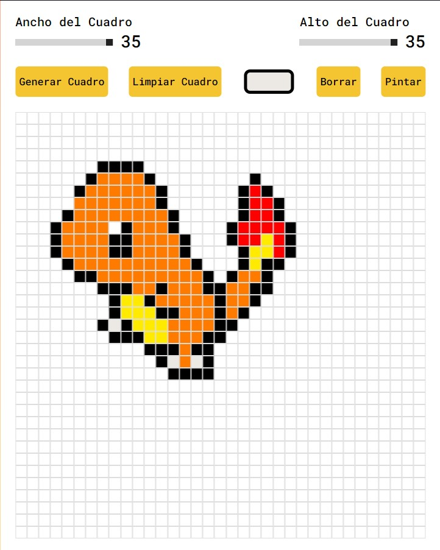
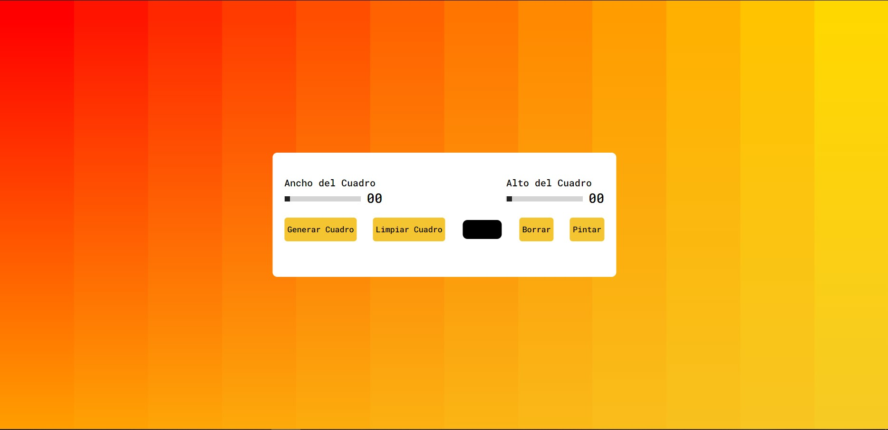
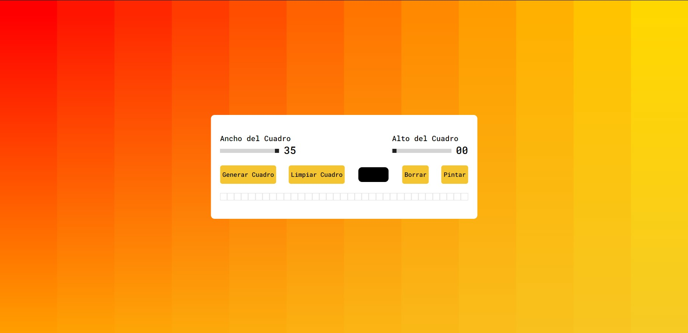
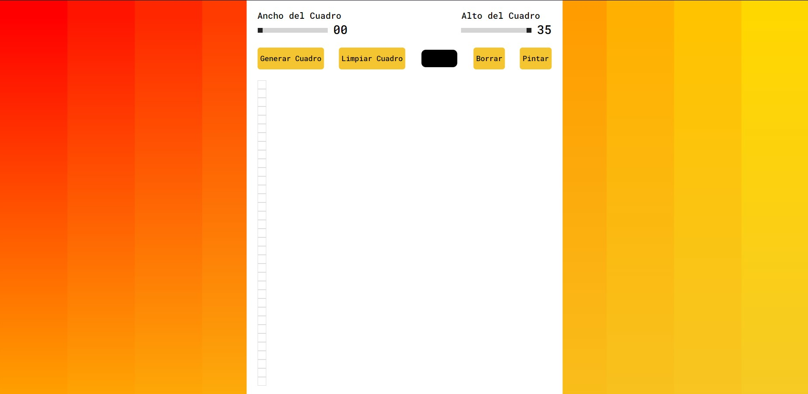

# Tabla-Pixel-Art
Crea una tabla decidiendo su tamaño de Ancho y de Largo y diseña tus propios Pixel Arts. Proyecto hecho en HTML, CSS y JS.

  
    
  
    
  
  

## ¿Cuál es el fin de este proyecto?
Es una simple pagina hecha en HTML, CSS y JavaScript. 
Su objetivo no es mas que el aprendisaje y practica de herramientas que nos puede proporcionar JavaScript.

## ¿Puedo Probarlo en Linea? 
Si, Puedes probarlo en linea haciendo click [aqui](https://carlosorellana00.github.io/Tabla-Pixel-Art/)

## ¿Cómo puedo probarlo de manera local en mi equipo?
puede copiarse directamente desde git a traves de comando o descargarse en un archivo Zip, el proyecto no requiere de ningun servicio de servidor para correrse
de manera local en una computadora.

## Modo de uso

El Programa se nos presenta de forma sensilla al abrir la vista.

   

Podemos decidir el Maximo del Ancho de recuadro que querramos establecer.

   

Tambien podemos decidir cual sera el Maximo del Largo de neustro recuadro.

   

## Agradecimientos:

- [Autor -> Coding Artist](https://www.youtube.com/c/CodingArtist)
- [Video -> Pixel Art Maker With Javascript | Step By Step Javascript Project ](https://www.youtube.com/watch?v=hBJJJWm2bUQ&t=73s)

## Material Extra Utilizado 

- [Icono de Pestaña](https://www.freepng.es)
- [Fondo de Pantalla](https://www.svgbackgrounds.com)
- [fuente de Letras](https://fonts.google.com/about)
